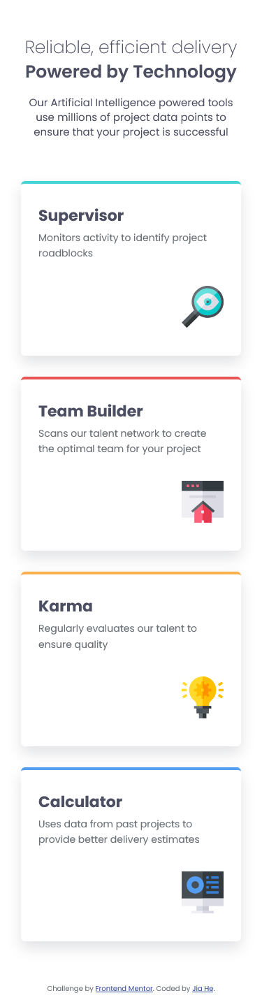

# Frontend Mentor - Four card feature section solution

This is my solution to the [Four card feature section challenge on Frontend Mentor](https://www.frontendmentor.io/challenges/four-card-feature-section-weK1eFYK). Frontend Mentor challenges help you improve your coding skills by building realistic projects.

## Table of contents

- [Overview](#overview)
  - [The challenge](#the-challenge)
  - [Screenshot](#screenshot)
  - [Links](#links)
- [My process](#my-process)
  - [Built with](#built-with)
  - [What I learned](#what-i-learned)
  - [Continued development](#continued-development)
  - [Useful resources](#useful-resources)
- [Author](#author)
- [Acknowledgments](#acknowledgments)

## Overview

### The challenge

Users should be able to:

- View the optimal layout for the site depending on their device's screen size

### Screenshot

#### 📱 Mobile



#### 💻 Desktop


### Links

- Solution URL: [My solution](https://www.frontendmentor.io/solutions/responsive-web-page-with-css-grid-and-flexbox-dnPLzDi9XK)
- Live Site URL: [Live site URL](https://four-card-feature-section-jiah.netlify.app/)

## My process

### Built with

- Semantic HTML5 markup
- CSS custom properties
- Flexbox
- CSS Grid

### What I learned

While building this component, I practiced:

- Using CSS Grid to layout the card container and place each card in its designated grid area

- Using align-self to align individual elements within a Flexbox container

- Applying margin-top: auto in a column-based Flexbox (flex-direction: column) to push an element to the bottom of the container

Here's a small snippet I'm proud of:

```css
footer {
  margin-top: auto;
}
```

### Continued development

I want to explore more layout and responsive design using CSS Grid in the future.

### Useful resources

- [Google font -- Poppins](https://fonts.google.com/specimen/Poppins)

## Author

- Frontend Mentor - [@JiaHe35354](https://www.frontendmentor.io/profile/JiaHe35354)
